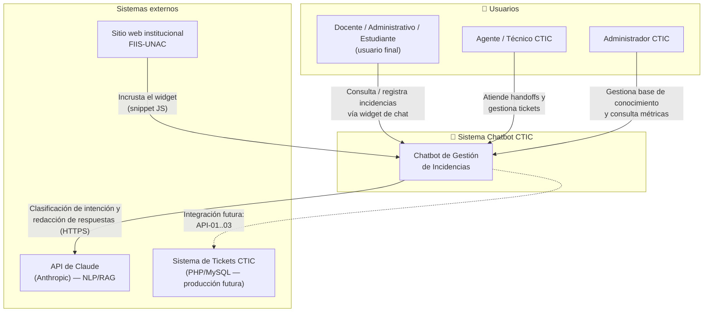
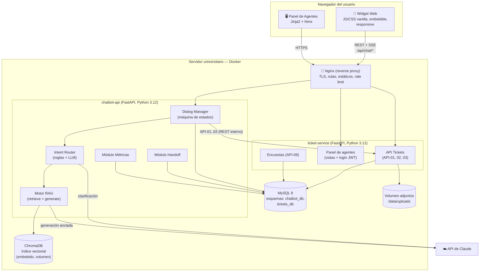
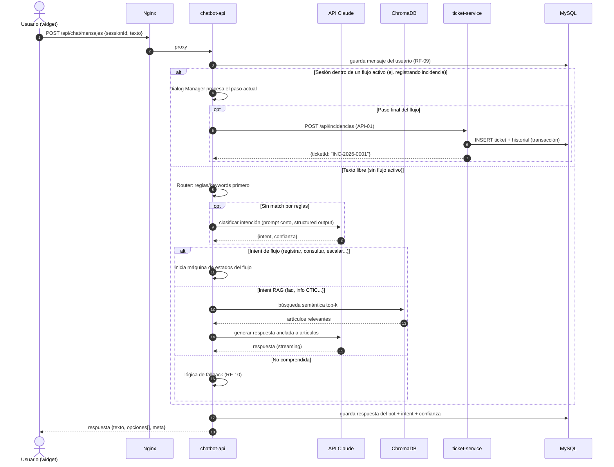
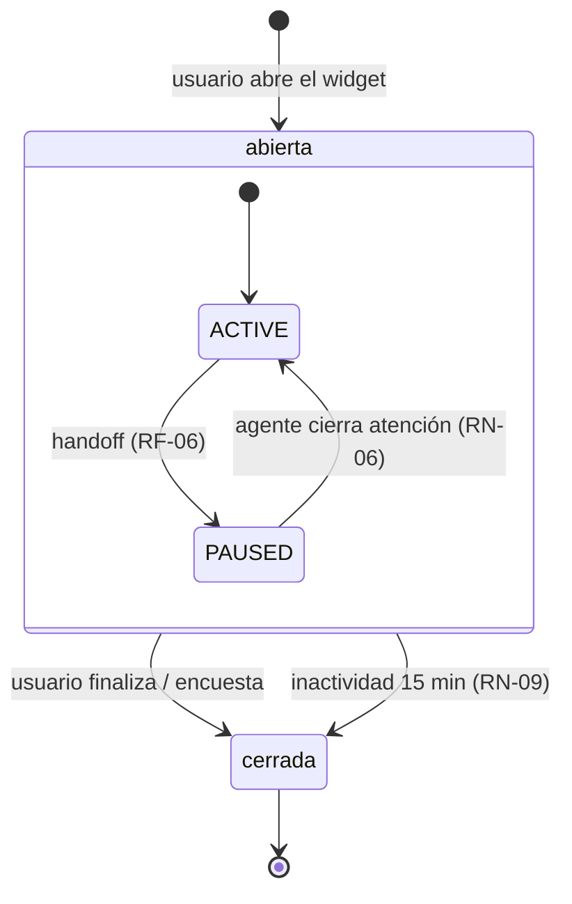
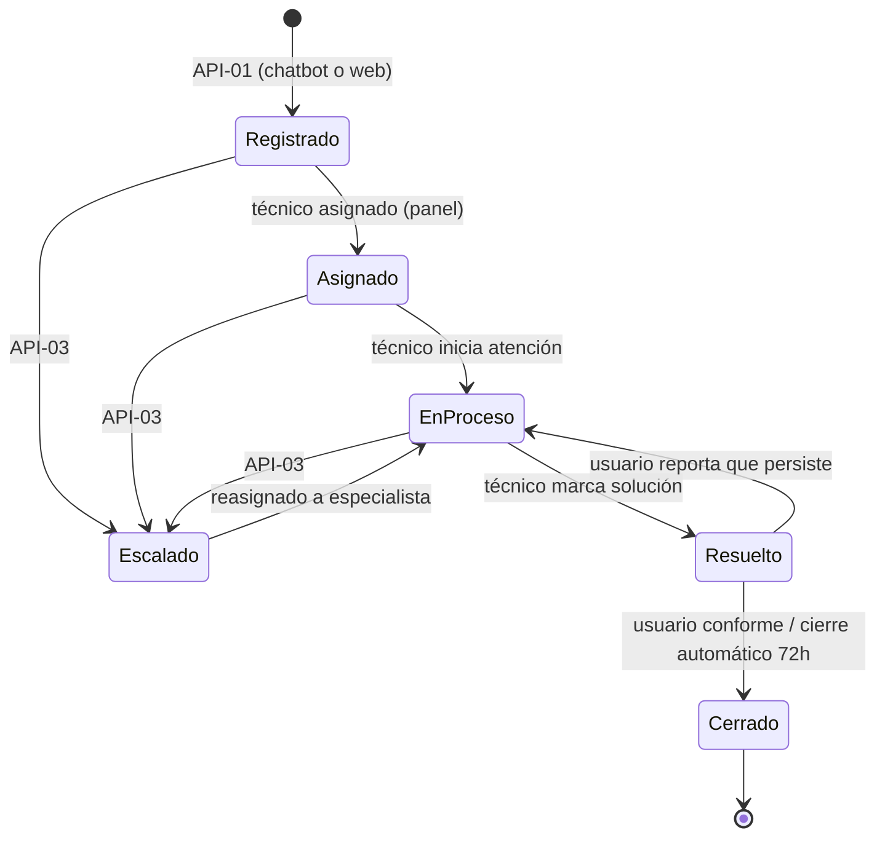

# PRD 02 — Arquitectura del Sistema

---

## 1. Vista de contexto (C4 nivel 1)

## 2. Vista de contenedores (C4 nivel 2)

### Responsabilidades por contenedor

| Contenedor | Responsabilidad | Tecnología |
|---|---|---|
| **widget** | UI de chat embebible: burbuja flotante, ventana de chat, botones de opciones, subida de adjuntos, indicador "escribiendo". Se integra con `<script src=".../widget.js">`. | JS vanilla + CSS (sin framework, para incrustación liviana) |
| **chatbot-api** | Orquesta el diálogo: sesiones, máquina de estados por flujo, router de intenciones, RAG, fallback, handoff, registro de conversaciones, métricas. **Único componente que llama al LLM.** | Python 3.12, FastAPI, SQLAlchemy, cliente oficial `anthropic`, `sentence-transformers`, `chromadb` |
| **ticket-service** | Dominio de tickets: CRUD, estados, historial, adjuntos, encuestas, panel de agentes con login. **Simula el sistema real** exponiendo exactamente los contratos API-01..03 del DRS. | Python 3.12, FastAPI, SQLAlchemy, Jinja2 + htmx |
| **mysql** | Persistencia. Dos esquemas separados (`chatbot_db`, `tickets_db`) para que el dominio de tickets sea desacoplable (ver ADR-03). | MySQL 8 |
| **nginx** | TLS, enrutamiento, servir widget/estáticos, límites de tamaño de request, rate limiting básico. | Nginx |
| **chromadb** | Índice vectorial de la base de conocimiento. Corre **embebido** dentro de `chatbot-api` con persistencia en volumen (no es un contenedor aparte en el MVP). | ChromaDB (modo persistente local) |

## 3. Flujo de un mensaje (vista dinámica)

## 4. Decisiones de arquitectura (ADRs)

### ADR-01 — Enfoque híbrido: flujos deterministas + LLM/RAG
- **Decisión:** las operaciones transaccionales (registrar, consultar, escalar, encuesta) se implementan como máquinas de estados con botones; el LLM se usa solo para (a) clasificar intención de texto libre y (b) redactar respuestas FAQ ancladas a la base de conocimiento.
- **Razones:** QA-11 exige 100 % de happy paths correctos (un LLM libre no lo garantiza); LF-06 prohíbe respuestas no verificadas; el costo por conversación baja un orden de magnitud; los pasos críticos son auditables.
- **Alternativas descartadas:** solo árbol de reglas (no cumple el enfoque IA/NLP del DRS); solo LLM con tools (impredecible para QA-11, mayor costo); Rasa (mayor esfuerzo de entrenamiento y peor manejo de frases no vistas); Dialogflow (lógica fuera del contenedor de la universidad, dependencia de nube externa).

### ADR-02 — Python + FastAPI para ambos servicios
- **Decisión:** backend en Python 3.12 con FastAPI.
- **Razones:** ecosistema NLP/RAG (sentence-transformers, chromadb, SDK `anthropic`); async nativo para streaming SSE; OpenAPI autogenerado (facilita la integración futura con el equipo PHP de la universidad); tipado con Pydantic = validación de entradas (SEG-04) declarativa.
- **Consecuencia:** el sistema de tickets real es PHP; la frontera entre mundos es siempre REST/JSON, nunca acceso directo a BD ajena.

### ADR-03 — `ticket-service` separado que simula el sistema real
- **Decisión:** los contratos API-01..03 (dominio tickets) viven en un servicio propio con su propio esquema (`tickets_db`), consumido por `chatbot-api` vía HTTP con una URL base configurable (`TICKETS_API_BASE_URL`).
- **Razones:** no hay acceso al sistema real durante la tesis; al separar el dominio, pasar a producción = apuntar la URL al sistema real (o a un adaptador PHP delgado sobre su MySQL) sin tocar el chatbot. El `ticket-service` de la tesis queda además como implementación de referencia para el equipo del CTIC.
- **Regla de diseño:** `chatbot-api` **nunca** lee `tickets_db` directamente; todo pasa por la API.

### ADR-04 — MySQL 8 como única BD relacional
- **Decisión:** MySQL 8 para ambos esquemas.
- **Razones:** paridad con el stack real de la universidad (facilita migración/adopción); soporte JSON para campos flexibles; conocimiento local del equipo CTIC.

### ADR-05 — Embeddings locales + ChromaDB embebido
- **Decisión:** vectorización con `sentence-transformers` (modelo multilingüe `paraphrase-multilingual-mpnet-base-v2` o `multilingual-e5-small`, elegible por benchmark en español durante la implementación) y ChromaDB en modo persistente dentro del proceso de `chatbot-api`.
- **Razones:** Anthropic no ofrece API de embeddings; un servicio de embeddings de pago (p. ej. Voyage AI) añade costo y dependencia innecesarios para un corpus pequeño (< 1000 artículos); los modelos locales multilingües funcionan bien en español y corren en CPU; Chroma embebido evita otro contenedor.
- **Límite conocido:** si la base de conocimiento creciera a decenas de miles de documentos o se necesitara alta concurrencia de indexación, migrar a un servidor vectorial dedicado (Chroma server, Qdrant) — la interfaz del módulo RAG lo permite.

### ADR-06 — LLM: API de Claude con modelo configurable
- **Decisión:** cliente oficial `anthropic` para Python; el modelo se define por variable de entorno `LLM_MODEL`. Recomendación por defecto: `claude-opus-4-8` (calidad máxima de respuesta); alternativa de bajo costo documentada: `claude-haiku-4-5` ($1/$5 por millón de tokens), adecuada para clasificación de intents y FAQ ancladas. La clasificación de intención puede usar un modelo distinto (`LLM_MODEL_ROUTER`) al de generación (`LLM_MODEL`).
- **Razones:** desempeño excelente en español; structured outputs para clasificación fiable; streaming SSE para cumplir REN-01 en respuestas largas. Detalle de prompts y costos en `prd/06`.

### ADR-07 — Contenedores Docker para todo el sistema
- **Decisión:** cada servicio es una imagen Docker; orquestación con `docker-compose` (dev y producción inicial).
- **Razones:** la propuesta se llevará a producción en un servidor de la universidad — los contenedores dan despliegue reproducible, aislamiento del resto del servidor (que hoy corre XAMPP), rollback por versión de imagen y paridad dev/prod. Evaluación completa y alternativas en `prd/07` §1.

### ADR-08 — Comunicación widget ↔ backend: REST + SSE
- **Decisión:** el widget envía mensajes por `POST` y recibe respuestas en el mismo request; para respuestas generadas por LLM se usa **Server-Sent Events** (streaming) de modo que el primer token llegue en < 3 s.
- **Alternativa descartada:** WebSockets — más complejidad (estado de conexión, proxies universitarios) sin beneficio claro para un chat de baja frecuencia. El push del agente→usuario durante handoff se resuelve con SSE de larga vida o polling corto (decisión de implementación, default: SSE).

## 5. Estados de la conversación y del bot

## 6. Estados del ticket

Todo cambio de estado escribe en `ticket_historial` (actor, estados, comentario, timestamp) — trazabilidad exigida por el contexto de la tesis.

## 7. Seguridad (SEG-01..05, PRI-01..04)

| Control | Implementación |
|---|---|
| Transporte | HTTPS en Nginx (certificado institucional o Let's Encrypt). Servicios internos solo en la red Docker, sin puertos publicados salvo 80/443. |
| Identificación usuario final | Correo institucional validado por formato y dominio; asociado a la sesión de chat. *(Producción futura: verificación por código al correo u SSO institucional — punto de extensión documentado, fuera del MVP.)* |
| Autenticación staff | Login con usuario/contraseña (hash Argon2), JWT de corta duración para el panel; roles `tecnico` y `admin`. |
| Autorización | RN-03: cada usuario solo ve sus tickets. Panel: técnicos ven tickets asignados y cola general; admin ve todo. |
| Validación de entradas | Pydantic en todos los endpoints; sanitización de texto; queries parametrizadas (SQLAlchemy); validación MIME real de adjuntos; límite de tamaño en Nginx y aplicación. |
| Secretos | Variables de entorno vía `.env` (nunca en el repo); la API key del LLM solo existe en `chatbot-api`. |
| Auditoría | `mensajes` (toda la conversación con intents), `ticket_historial` (cambios de estado), logs de aplicación estructurados (JSON) con retención definida por el CTIC. |
| Protección de información (LF-09) | El prompt del sistema prohíbe revelar credenciales/datos de terceros; el contexto RAG solo contiene artículos públicos de la KB; los datos personales nunca se envían al LLM salvo el texto que el propio usuario escribe. |
| Rate limiting | Nginx: límite por IP en `/api/chat/*` (mitiga abuso y controla costo de LLM). |

## 8. Rendimiento y disponibilidad (REN-01..06)

- **≤ 3 s:** respuestas de flujo son locales (< 100 ms típico). Clasificación de intención con LLM: prompt corto (~1 s). Respuestas RAG: streaming SSE — primer token < 3 s aunque la respuesta completa tarde más.
- **Concurrencia:** FastAPI async + pool de conexiones MySQL; objetivo 50 sesiones simultáneas en un servidor modesto (2 vCPU / 4 GB). El modelo de embeddings se carga una vez en memoria (~500 MB RAM).
- **Disponibilidad:** `restart: unless-stopped` en compose, healthchecks por servicio, y Nginx devuelve una página de mantenimiento si el backend no responde. Si la API del LLM falla, el bot degrada con gracia: sigue operando los flujos guiados y responde en FAQ con coincidencia por palabras clave + mensaje de disculpa (REN-05).
- **Backups:** dump diario de MySQL + copia del volumen de adjuntos y del índice Chroma (ver `prd/07` §6).
