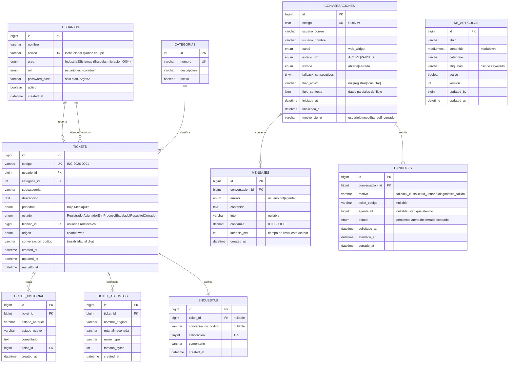

# PRD 03 — Modelo de Datos

Base de datos: **MySQL 8**, charset `utf8mb4`, collation `utf8mb4_unicode_ci`, motor InnoDB.
Dos esquemas (ver ADR-03): `tickets_db` (dominio de tickets — reemplazable por el sistema real) y `chatbot_db` (dominio conversacional — propiedad del chatbot).

---

## 1. Diagrama entidad-relación



> Relación entre esquemas: `TICKETS.conversacion_codigo` y `HANDOFFS.ticket_codigo`/`ENCUESTAS.conversacion_codigo` son referencias **lógicas por código** (no FK físicas), porque los esquemas deben poder vivir en servidores distintos cuando el sistema de tickets sea el real (ADR-03).

## 2. DDL — `tickets_db`

```sql
CREATE DATABASE IF NOT EXISTS tickets_db
  CHARACTER SET utf8mb4 COLLATE utf8mb4_unicode_ci;
USE tickets_db;

CREATE TABLE usuarios (
  id            BIGINT UNSIGNED AUTO_INCREMENT PRIMARY KEY,
  nombre        VARCHAR(120)  NOT NULL,
  correo        VARCHAR(150)  NOT NULL UNIQUE,
  area          ENUM('Industrial','Sistemas') NOT NULL DEFAULT 'Industrial', -- migración 0004
  rol           ENUM('usuario','tecnico','admin') NOT NULL DEFAULT 'usuario',
  password_hash VARCHAR(255)  NULL COMMENT 'Solo staff (tecnico/admin), Argon2id',
  activo        BOOLEAN       NOT NULL DEFAULT TRUE,
  created_at    DATETIME      NOT NULL DEFAULT CURRENT_TIMESTAMP,
  CONSTRAINT chk_correo_unac CHECK (correo LIKE '%@unac.edu.pe' OR rol <> 'usuario')
) ENGINE=InnoDB;

CREATE TABLE categorias (
  id          INT UNSIGNED AUTO_INCREMENT PRIMARY KEY,
  nombre      VARCHAR(80)  NOT NULL UNIQUE,
  descripcion VARCHAR(255) NULL,
  activo      BOOLEAN      NOT NULL DEFAULT TRUE
) ENGINE=InnoDB;

CREATE TABLE tickets (
  id                  BIGINT UNSIGNED AUTO_INCREMENT PRIMARY KEY,
  codigo              VARCHAR(20)   NOT NULL UNIQUE COMMENT 'INC-AAAA-NNNN (RN-01)',
  usuario_id          BIGINT UNSIGNED NOT NULL,
  categoria_id        INT UNSIGNED  NOT NULL,
  subcategoria        VARCHAR(120)  NULL,
  descripcion         TEXT          NOT NULL,
  prioridad           ENUM('Baja','Media','Alta') NOT NULL DEFAULT 'Media',
  estado              ENUM('Registrado','Asignado','En Proceso','Escalado','Resuelto','Cerrado')
                      NOT NULL DEFAULT 'Registrado',
  tecnico_id          BIGINT UNSIGNED NULL,
  origen              ENUM('chatbot','web') NOT NULL DEFAULT 'chatbot',
  conversacion_codigo CHAR(36)      NULL COMMENT 'UUID de la conversación de origen',
  created_at          DATETIME      NOT NULL DEFAULT CURRENT_TIMESTAMP,
  updated_at          DATETIME      NOT NULL DEFAULT CURRENT_TIMESTAMP ON UPDATE CURRENT_TIMESTAMP,
  resuelto_at         DATETIME      NULL,
  respuesta           VARCHAR(1000) NULL COMMENT 'Nota del técnico para el estudiante (RF-02)',
  FOREIGN KEY (usuario_id)   REFERENCES usuarios(id),
  FOREIGN KEY (categoria_id) REFERENCES categorias(id),
  FOREIGN KEY (tecnico_id)   REFERENCES usuarios(id),
  INDEX idx_tickets_estado (estado),
  INDEX idx_tickets_usuario (usuario_id),
  INDEX idx_tickets_created (created_at)
) ENGINE=InnoDB;

-- Correlativo anual para RN-01 (generación transaccional del código)
CREATE TABLE ticket_secuencias (
  anio        SMALLINT UNSIGNED PRIMARY KEY,
  ultimo_nro  INT UNSIGNED NOT NULL DEFAULT 0
) ENGINE=InnoDB;

CREATE TABLE ticket_historial (
  id              BIGINT UNSIGNED AUTO_INCREMENT PRIMARY KEY,
  ticket_id       BIGINT UNSIGNED NOT NULL,
  estado_anterior VARCHAR(20) NULL,
  estado_nuevo    VARCHAR(20) NOT NULL,
  comentario      TEXT        NULL,
  actor_id        BIGINT UNSIGNED NULL COMMENT 'NULL = acción del sistema/chatbot',
  created_at      DATETIME    NOT NULL DEFAULT CURRENT_TIMESTAMP,
  FOREIGN KEY (ticket_id) REFERENCES tickets(id) ON DELETE CASCADE,
  FOREIGN KEY (actor_id)  REFERENCES usuarios(id),
  INDEX idx_hist_ticket (ticket_id)
) ENGINE=InnoDB;

CREATE TABLE ticket_adjuntos (
  id              BIGINT UNSIGNED AUTO_INCREMENT PRIMARY KEY,
  ticket_id       BIGINT UNSIGNED NOT NULL,
  nombre_original VARCHAR(255) NOT NULL,
  ruta_almacenada VARCHAR(500) NOT NULL COMMENT 'fuera del árbol web, nombre aleatorio',
  mime_type       VARCHAR(100) NOT NULL COMMENT 'image/jpeg|image/png|application/pdf (RF-13)',
  tamano_bytes    INT UNSIGNED NOT NULL COMMENT 'máx 5 MB',
  created_at      DATETIME     NOT NULL DEFAULT CURRENT_TIMESTAMP,
  FOREIGN KEY (ticket_id) REFERENCES tickets(id) ON DELETE CASCADE
) ENGINE=InnoDB;

CREATE TABLE encuestas (
  id                  BIGINT UNSIGNED AUTO_INCREMENT PRIMARY KEY,
  ticket_id           BIGINT UNSIGNED NULL,
  conversacion_codigo CHAR(36) NULL,
  calificacion        TINYINT UNSIGNED NOT NULL,
  comentario          VARCHAR(500) NULL,
  created_at          DATETIME NOT NULL DEFAULT CURRENT_TIMESTAMP,
  -- Sin acción referencial: MySQL no permite ON DELETE SET NULL sobre columnas
  -- usadas en un CHECK (err. 3823); los tickets se cierran, nunca se eliminan.
  FOREIGN KEY (ticket_id) REFERENCES tickets(id),
  CONSTRAINT chk_calificacion CHECK (calificacion BETWEEN 1 AND 5),
  CONSTRAINT chk_encuesta_origen CHECK (ticket_id IS NOT NULL OR conversacion_codigo IS NOT NULL)
) ENGINE=InnoDB;
```

## 3. DDL — `chatbot_db`

```sql
CREATE DATABASE IF NOT EXISTS chatbot_db
  CHARACTER SET utf8mb4 COLLATE utf8mb4_unicode_ci;
USE chatbot_db;

CREATE TABLE conversaciones (
  id                    BIGINT UNSIGNED AUTO_INCREMENT PRIMARY KEY,
  codigo                CHAR(36)     NOT NULL UNIQUE COMMENT 'UUID v4 = sessionId del widget',
  usuario_correo        VARCHAR(150) NULL COMMENT 'se llena al identificarse (RF-15)',
  usuario_nombre        VARCHAR(120) NULL,
  canal                 ENUM('web_widget') NOT NULL DEFAULT 'web_widget',
  estado_bot            ENUM('ACTIVE','PAUSED') NOT NULL DEFAULT 'ACTIVE',
  estado                ENUM('abierta','cerrada') NOT NULL DEFAULT 'abierta',
  fallback_consecutivos TINYINT UNSIGNED NOT NULL DEFAULT 0,
  flujo_activo          VARCHAR(40)  NULL COMMENT 'registrar_incidencia|consultar_estado|...',
  flujo_contexto        JSON         NULL COMMENT 'datos parciales del flujo en curso',
  iniciada_at           DATETIME     NOT NULL DEFAULT CURRENT_TIMESTAMP,
  finalizada_at         DATETIME     NULL,
  motivo_cierre         VARCHAR(30)  NULL,
  INDEX idx_conv_estado (estado),
  INDEX idx_conv_correo (usuario_correo)
) ENGINE=InnoDB;

CREATE TABLE mensajes (
  id              BIGINT UNSIGNED AUTO_INCREMENT PRIMARY KEY,
  conversacion_id BIGINT UNSIGNED NOT NULL,
  emisor          ENUM('usuario','bot','agente') NOT NULL,
  contenido       TEXT         NOT NULL,
  intent          VARCHAR(40)  NULL,
  confianza       DECIMAL(4,3) NULL,
  latencia_ms     INT UNSIGNED NULL COMMENT 'para KPI de tiempo de respuesta',
  created_at      DATETIME(3)  NOT NULL DEFAULT CURRENT_TIMESTAMP(3),
  FOREIGN KEY (conversacion_id) REFERENCES conversaciones(id) ON DELETE CASCADE,
  INDEX idx_msg_conv (conversacion_id),
  INDEX idx_msg_intent (intent),
  INDEX idx_msg_fecha (created_at)
) ENGINE=InnoDB;

CREATE TABLE kb_articulos (
  id         BIGINT UNSIGNED AUTO_INCREMENT PRIMARY KEY,
  titulo     VARCHAR(200)  NOT NULL,
  contenido  MEDIUMTEXT    NOT NULL COMMENT 'markdown; fuente de verdad del índice vectorial',
  categoria  VARCHAR(80)   NOT NULL,
  etiquetas  VARCHAR(300)  NULL COMMENT 'keywords separadas por coma (matching por reglas)',
  activo     BOOLEAN       NOT NULL DEFAULT TRUE,
  version    INT UNSIGNED  NOT NULL DEFAULT 1,
  updated_by BIGINT UNSIGNED NULL,
  updated_at DATETIME      NOT NULL DEFAULT CURRENT_TIMESTAMP ON UPDATE CURRENT_TIMESTAMP,
  FULLTEXT KEY ft_kb (titulo, contenido)
) ENGINE=InnoDB;

CREATE TABLE handoffs (
  id              BIGINT UNSIGNED AUTO_INCREMENT PRIMARY KEY,
  conversacion_id BIGINT UNSIGNED NOT NULL,
  motivo          VARCHAR(40)  NOT NULL COMMENT 'fallback_x3|solicitud_usuario|diagnostico_fallido',
  ticket_codigo   VARCHAR(20)  NULL,
  agente_id       BIGINT UNSIGNED NULL COMMENT 'id de usuarios (tickets_db), referencia lógica',
  estado          ENUM('pendiente','atendido','cerrado','expirado') NOT NULL DEFAULT 'pendiente',
  solicitado_at   DATETIME NOT NULL DEFAULT CURRENT_TIMESTAMP,
  atendido_at     DATETIME NULL,
  cerrado_at      DATETIME NULL,
  FOREIGN KEY (conversacion_id) REFERENCES conversaciones(id) ON DELETE CASCADE,
  INDEX idx_handoff_estado (estado)
) ENGINE=InnoDB;
```

## 4. Vistas de métricas (RF-14, soporte al pre/post-test)

```sql
USE chatbot_db;

-- Tasa de autoservicio: conversaciones cerradas sin ticket asociado
CREATE OR REPLACE VIEW v_autoservicio_diario AS
SELECT DATE(c.iniciada_at) AS fecha,
       COUNT(*) AS conversaciones,
       SUM(CASE WHEN t.codigo IS NULL THEN 1 ELSE 0 END) AS sin_ticket,
       ROUND(100 * SUM(CASE WHEN t.codigo IS NULL THEN 1 ELSE 0 END) / COUNT(*), 1) AS pct_autoservicio
FROM conversaciones c
LEFT JOIN tickets_db.tickets t ON t.conversacion_codigo = c.codigo
WHERE c.estado = 'cerrada'
GROUP BY DATE(c.iniciada_at);

-- Tiempo de respuesta del bot (KPI REN-01 / tesis)
CREATE OR REPLACE VIEW v_latencia_bot AS
SELECT DATE(created_at) AS fecha,
       COUNT(*) AS respuestas,
       ROUND(AVG(latencia_ms)) AS latencia_prom_ms,
       MAX(latencia_ms) AS latencia_max_ms
FROM mensajes
WHERE emisor = 'bot' AND latencia_ms IS NOT NULL
GROUP BY DATE(created_at);

-- Intenciones más frecuentes
CREATE OR REPLACE VIEW v_intents_frecuentes AS
SELECT intent, COUNT(*) AS total
FROM mensajes
WHERE emisor = 'usuario' AND intent IS NOT NULL
GROUP BY intent ORDER BY total DESC;
```

```sql
USE tickets_db;

-- Satisfacción promedio (KPI de tesis)
CREATE OR REPLACE VIEW v_satisfaccion AS
SELECT DATE(created_at) AS fecha,
       COUNT(*) AS encuestas,
       ROUND(AVG(calificacion), 2) AS calificacion_prom
FROM encuestas GROUP BY DATE(created_at);

-- Tiempo de resolución de tickets
CREATE OR REPLACE VIEW v_tiempo_resolucion AS
SELECT t.codigo, t.estado, c.nombre AS categoria,
       TIMESTAMPDIFF(HOUR, t.created_at, t.resuelto_at) AS horas_resolucion
FROM tickets t JOIN categorias c ON c.id = t.categoria_id
WHERE t.resuelto_at IS NOT NULL;
```

## 5. Datos semilla (seeds)

- **categorias:** Correo Institucional, Internet/WiFi, Aula Virtual, Software Institucional, Equipos de Cómputo, Cuentas y Accesos, Otros (seed 0002) + Problemas con la página web de la facultad, SGA, Equipos Tecnológicos, Laboratorios, Solicitudes Tecnológicas (seed 0004).
- **usuarios staff:** 1 admin + 2 técnicos de prueba (contraseñas por variable de entorno en el seed, nunca hardcodeadas).
- **kb_articulos:** mínimo 15 artículos iniciales que cubran las intenciones 4–8 de la matriz (recuperación de contraseña, conexión WiFi por sede, caché del navegador para Aula Virtual, horario y contacto del CTIC, etc.). El contenido lo valida el CTIC antes del post-test.
- **ticket_secuencias:** fila del año en curso con `ultimo_nro = 0`.

## 6. Notas para la migración a producción

- El esquema `tickets_db` replica la semántica esperada del Sistema de Tickets CTIC real. Al integrarse con el sistema real, `tickets_db` deja de usarse y `chatbot_db` permanece intacto (solo referencias lógicas por código de ticket).
- Migraciones versionadas con **Alembic** (una carpeta por esquema) — nunca `CREATE TABLE` manual en producción.
- El índice vectorial de Chroma se reconstruye desde `kb_articulos` con un comando idempotente (`reindex`), por lo que no requiere backup estricto (aunque se respalde por conveniencia).
