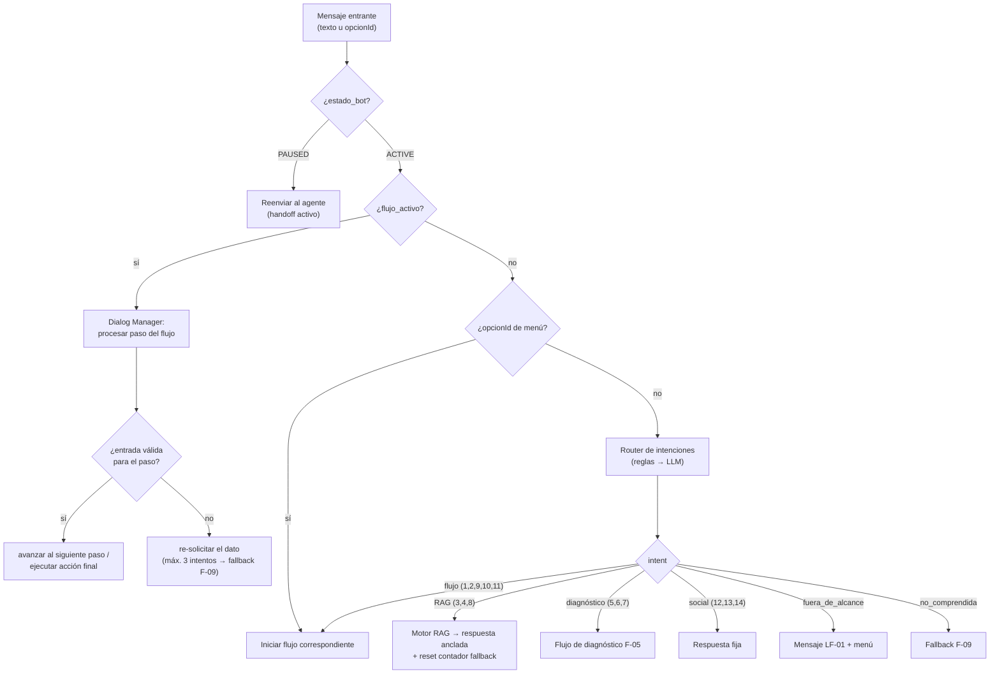
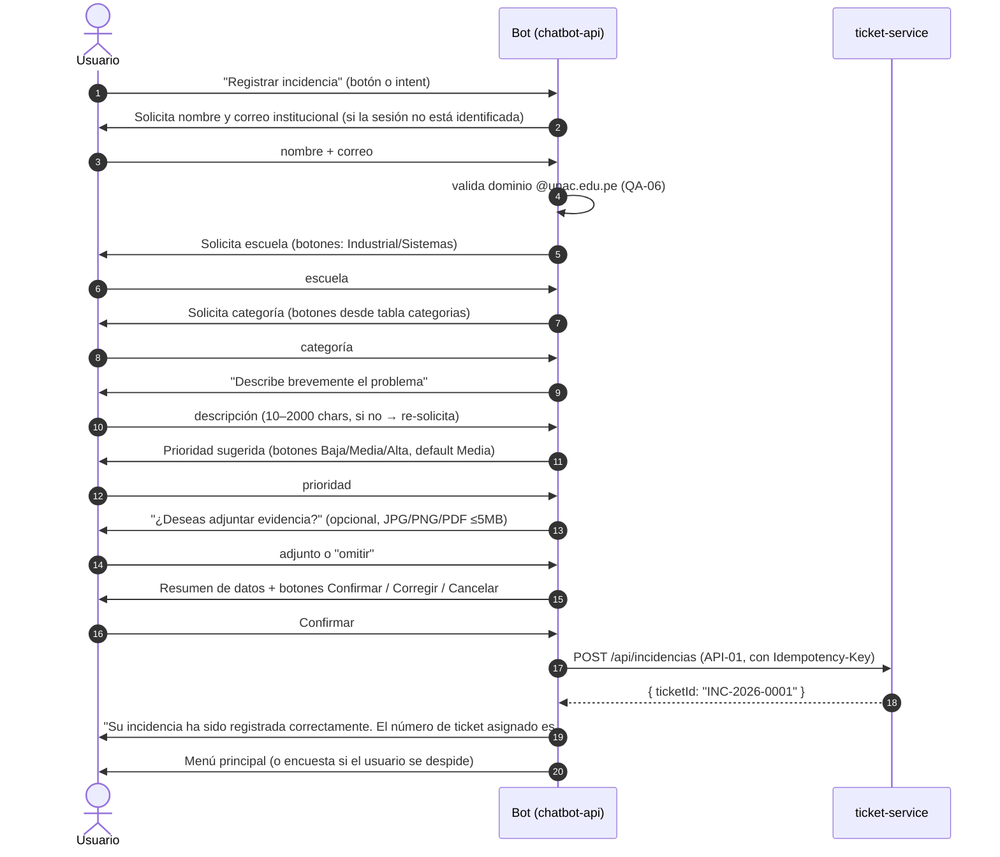
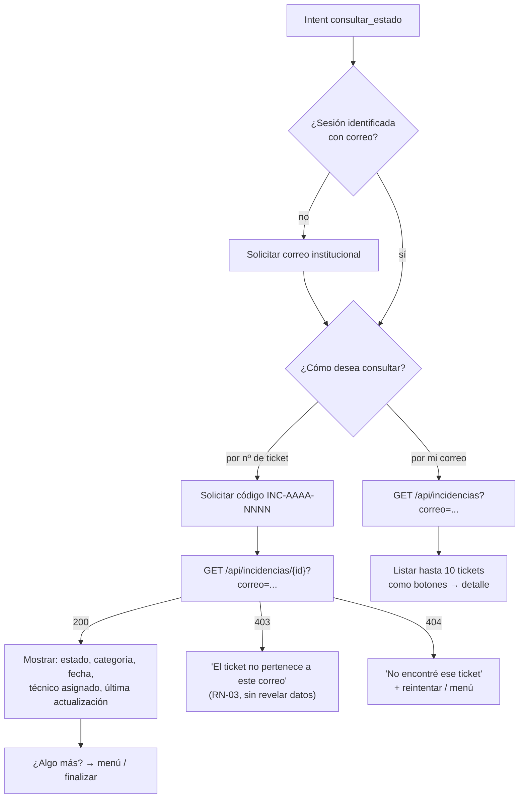
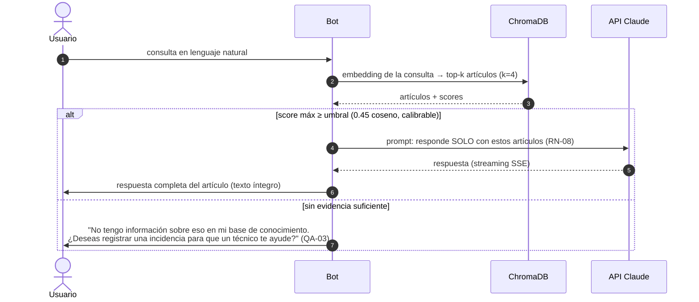
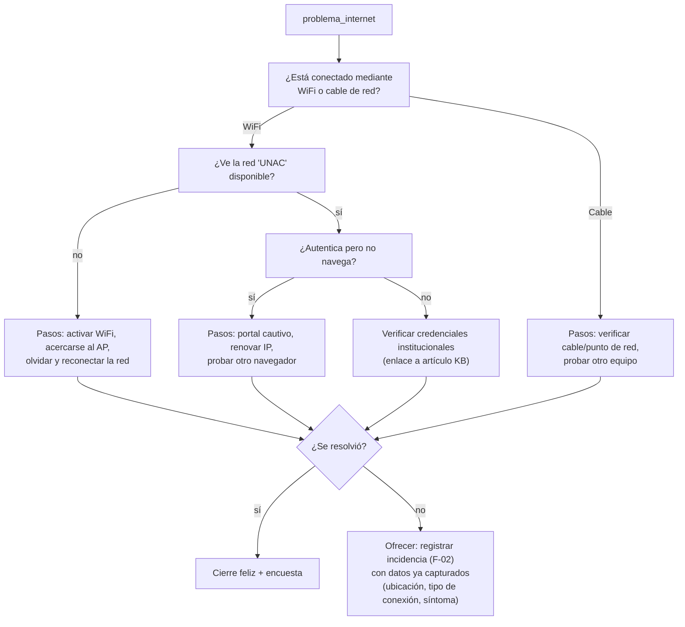
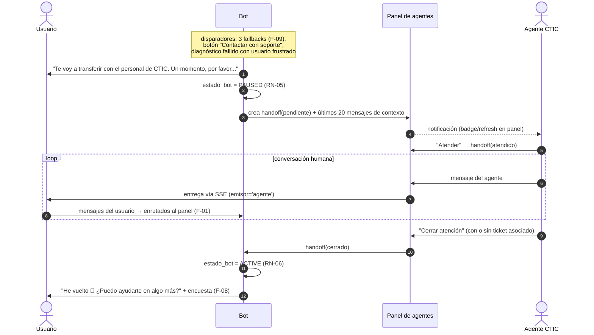
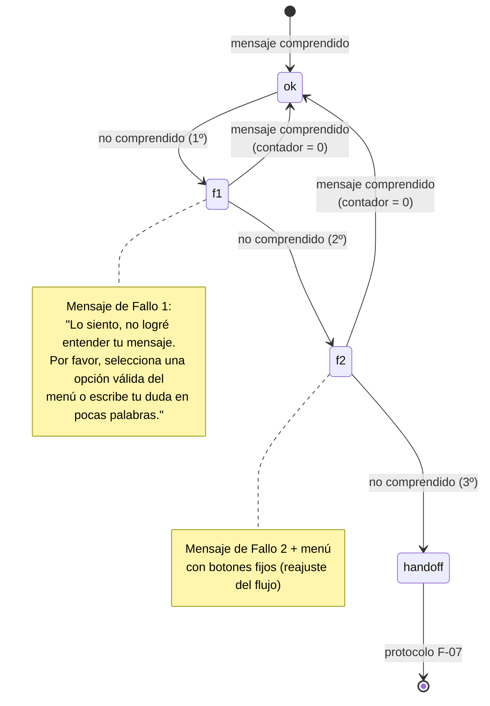

# PRD 05 — Flujos Conversacionales y Lógica de Navegación

El diálogo se modela como una **máquina de estados por conversación**: la columna `conversaciones.flujo_activo` indica el flujo en curso y `flujo_contexto` (JSON) guarda los datos parciales. Si no hay flujo activo, el mensaje pasa al **router de intenciones** (`prd/06` §2).

Convención de IDs: F-01 … F-09. Cada flujo lista sus estados, transiciones y mensajes.

---

## F-01 · Enrutamiento general (qué pasa con cada mensaje)

## F-02 · Registrar incidencia (happy path del DRS)

Pasos del DRS 1–12 formalizados. Estados del flujo: `identificacion → categoria → descripcion → prioridad → adjunto → confirmacion → creado`.

Reglas: en `Corregir`, el bot pregunta qué campo cambiar y vuelve a `confirmacion`. En `Cancelar`, descarta `flujo_contexto` y vuelve al menú. Si `ticket-service` falla: mensaje de disculpa + botón "Reintentar" (los datos capturados no se pierden — REN-05, REN-02).

## F-03 · Consultar estado de incidencia

## F-04 · Preguntas frecuentes (RAG)

## F-05 · Diagnóstico básico guiado (QA-04)

Árboles de decisión **estáticos y versionados en código/BD** (no LLM), uno por categoría. Ejemplo WiFi:

Los otros árboles (Aula Virtual, software institucional, correo) siguen el mismo patrón; sus pasos provienen de artículos KB marcados como `categoria='diagnostico'`. El contexto capturado durante el diagnóstico **pre-llena** el flujo F-02 si se decide registrar (evita repreguntar).

## F-06 · Escalar incidencia

1. Bot solicita nº de ticket (o lo toma del contexto si la conversación ya lo consultó).
2. Bot solicita motivo (texto libre, 10–500 chars).
3. `PUT /api/incidencias/escalar` (API-03) validando propiedad por correo.
4. Confirmación: «Su incidencia requiere atención especializada. El caso ha sido escalado al personal técnico del CTIC. Recibirá una notificación cuando exista una actualización.»
5. Errores: ticket inexistente → reintento; ticket en estado no escalable (`Resuelto`/`Cerrado`) → explica y ofrece registrar una nueva incidencia.

## F-07 · Handoff a agente humano (protocolo del DRS)

Si ningún agente atiende en **10 minutos** (configurable): el bot se disculpa, ofrece registrar una incidencia (F-02) para atención asíncrona y marca el handoff `expirado`.

## F-08 · Encuesta de satisfacción

- Disparadores: cierre de handoff, ticket registrado + despedida, FAQ resuelta + despedida, intent `finalizar`.
- Mensaje: «Antes de finalizar, ¿podría calificar la atención recibida del 1 al 5?» — botones ⭐1–⭐5, luego comentario opcional (o botón "Omitir").
- `POST /api/encuesta` (API-06) con `ticketId` si la atención generó/consultó un ticket, si no `conversacionCodigo`.
- Solo se ofrece una vez por atención (RN-04); si el usuario la ignora, la conversación cierra igual.

## F-09 · Gestión de errores / Fallback (RF-10, DRS §Fallback)

"No comprendido" = intent `no_comprendida`, o confianza del router < 0.55, o 3 entradas inválidas seguidas dentro de un paso de flujo. El contador `fallback_consecutivos` vive en `conversaciones` y se reinicia con cualquier mensaje procesado con éxito.

---

## Mapa de cobertura DRS → flujos

| Elemento del DRS | Flujo |
|---|---|
| Happy Path pasos 1–12 | F-02 (+ F-08 paso 12) |
| Fallback 1º/2º/3º error | F-09 |
| Protocolo de handoff (PAUSED/ACTIVE, 20 mensajes) | F-07 |
| Intents 1–11 de la matriz | F-02…F-08 según tabla en `prd/01` §2 |
| Intenciones adicionales PLN (saludo, gracias, despedida, no comprendida, fuera de alcance) | F-01 (respuestas fijas) |
