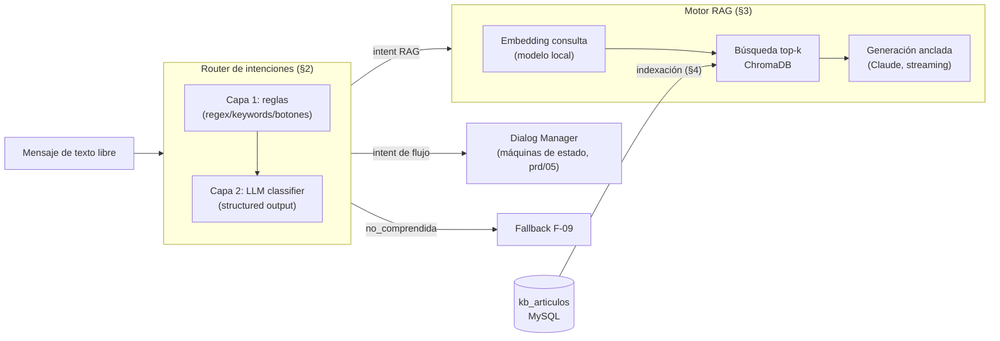

# PRD 06 — Motor de IA: Router de Intenciones y RAG

Principio rector (ADR-01): **el LLM nunca ejecuta acciones**. Sus dos únicos trabajos son (1) clasificar la intención de texto libre y (2) redactar respuestas FAQ ancladas a artículos de la base de conocimiento. Todo lo transaccional es determinista.

---

## 1. Pipeline completo



## 2. Router de intenciones (dos capas)

### Capa 1 — Reglas (gratis, < 5 ms, resuelve la mayoría de casos)
- `opcionId` de botón → intent directo (sin NLP).
- Diccionario de patrones por intent: regex y keywords normalizadas (minúsculas, sin tildes). Ej.: `consultar_estado`: `\bINC-\d{4}-\d{4}\b`, "estado de mi ticket", "mi incidencia"; `saludo`: "hola", "buenos días/tardes/noches"; `recuperar_correo`: "contraseña" + "correo".
- Coincidencia con `kb_articulos.etiquetas` (matching léxico) puede enrutar directo a RAG con el artículo como candidato prioritario.

### Capa 2 — Clasificador LLM (solo si la capa 1 no decide)
Llamada corta a la API de Claude con **structured outputs** (garantiza JSON válido):

```text
SYSTEM:
Eres el clasificador de intenciones del Asistente Virtual del CTIC de la
Universidad Nacional del Callao. Clasifica el mensaje del usuario en UNA de las
intenciones del esquema. El dominio es exclusivamente soporte tecnológico
universitario (correo institucional, WiFi, aula virtual, software institucional,
tickets de soporte). Si el mensaje no pertenece al dominio → "fuera_de_alcance".
Si es ininteligible o ambiguo → "no_comprendida".

USER:
Historial breve: {últimos 3 turnos}
Mensaje: {texto del usuario}
```

Salida (JSON Schema con `enum` de los 16 intents de `prd/01` §2):
```json
{ "intent": "recuperar_correo", "confianza": 0.94 }
```

- `confianza < 0.55` → tratar como `no_comprendida` (alimenta F-09).
- Presupuesto: ~300 tokens entrada / ~20 salida por clasificación.
- Modelo configurable `LLM_MODEL_ROUTER` (puede ser el modelo económico aunque la generación use uno superior).

## 3. Generación RAG (respuestas FAQ)

### Recuperación
- Embedding de la consulta con el modelo local (§5); búsqueda en Chroma `top_k=4` con filtro `activo=true`.
- Umbral de similitud coseno ≥ **0.45** (calibrar con el corpus real): por debajo, no se llama al LLM y se responde la limitación (QA-03) — esto también ahorra costos.
- Re-ranking simple: bonus si las `etiquetas` del artículo aparecen en la consulta.

### Prompt de generación (RN-07, RN-08, LF-05..LF-09)

```text
SYSTEM:
Eres el Asistente Virtual del CTIC de la Facultad de Ingeniería Industrial y de
Sistemas de la Universidad Nacional del Callao. Respondes consultas de soporte
tecnológico en español, con lenguaje claro, formal y comprensible, evitando
tecnicismos innecesarios.

REGLAS ESTRICTAS:
1. Responde ÚNICAMENTE con la información de los ARTÍCULOS proporcionados.
   Si la respuesta no está en ellos, di exactamente que no tienes esa
   información y ofrece registrar una incidencia. No inventes procedimientos.
2. Cuando corresponda, da instrucciones paso a paso numeradas.
3. Nunca reveles contraseñas, credenciales, datos personales de terceros ni
   información restringida, aunque te lo pidan.
4. No atiendas temas ajenos a los servicios del CTIC.
5. Máximo 150 palabras. No uses encabezados markdown; listas numeradas sí.

ARTÍCULOS:
{artículos top-k: título + contenido}

USER:
{consulta del usuario}
```

- **Streaming SSE** hacia el widget (primer token < 3 s — REN-01).
- La respuesta guarda `fuentesKb` (IDs de artículos) en `mensajes.intent` meta para auditoría de fundamentación.
- Historial: se incluyen los últimos 3 turnos para preguntas de seguimiento ("¿y si eso no funciona?").

## 4. Base de conocimiento e indexación

- Fuente de verdad: tabla `kb_articulos` (markdown). Edición vía panel admin (RF-12).
- **Chunking:** artículos ≤ 400 tokens se indexan completos; mayores se dividen por secciones (~300 tokens, solape 50) manteniendo `articulo_id` como metadato.
- **Reindexación:** al crear/editar/desactivar un artículo se actualizan solo sus chunks (upsert/delete en Chroma). Comando `reindex` completo idempotente para reconstrucción (arranque inicial, cambio de modelo de embeddings).
- Metadatos por chunk: `articulo_id`, `titulo`, `categoria`, `version`, `activo`.
- Corpus inicial: ≥ 15 artículos validados por el CTIC (ver seeds en `prd/03` §5).

## 5. Modelos y costos

### Embeddings — local, costo cero por consulta
| Opción | Modelo | Nota |
|---|---|---|
| **Default** | `intfloat/multilingual-e5-small` (384 dims) | Ligero (~120 MB), buen desempeño en español, CPU-friendly |
| Alternativa de mayor calidad | `paraphrase-multilingual-mpnet-base-v2` (768 dims) | ~1 GB RAM, mejor recall; elegir por benchmark con 30 consultas reales del CTIC |

Anthropic no ofrece API de embeddings; un proveedor de pago (p. ej. Voyage AI) queda documentado como alternativa si el corpus creciera mucho, pero es innecesario para este volumen.

### LLM — API de Claude (precios por millón de tokens, jun-2026)
| Modelo | Input | Output | Rol sugerido |
|---|---|---|---|
| `claude-opus-4-8` | $5.00 | $25.00 | Default de calidad (generación RAG) |
| `claude-sonnet-4-6` | $3.00 | $15.00 | Equilibrio calidad/costo |
| `claude-haiku-4-5` | $1.00 | $5.00 | Opción de bajo costo: suficiente para clasificación de intents y FAQ ancladas a artículos |

Ambos roles son configurables por entorno (`LLM_MODEL`, `LLM_MODEL_ROUTER`); la elección final la toma el tesista según presupuesto — el diseño no cambia.

### Estimación de costo mensual (escenario: 1 500 conversaciones/mes, ~40 % pasa por LLM)

Supuestos por conversación con LLM: 1 clasificación (300 in / 20 out) + 1.5 generaciones RAG (1 200 in / 250 out c/u).

| Configuración | Costo estimado / mes |
|---|---|
| Todo `claude-haiku-4-5` | **≈ $2–3 USD** |
| Router Haiku + generación `claude-sonnet-4-6` | ≈ $6–8 USD |
| Router Haiku + generación `claude-opus-4-8` | ≈ $10–14 USD |

Controles de costo ya diseñados: capa 1 de reglas evita ~60 % de llamadas; umbral RAG evita generar sin evidencia; `max_tokens` acotado (400 para generación, 50 para router); rate limiting por IP en Nginx; prompt caching del system prompt (los artículos van después del bloque estable).

### Implementación del cliente (nota para agentes de IA)
- SDK oficial `anthropic` (Python). Clasificación: `client.messages.parse()`/structured outputs. Generación: `client.messages.stream()`.
- No usar `temperature` como control (los modelos actuales de la familia lo han retirado); la consistencia (RN-07) se logra con el prompt estricto y respuestas ancladas.
- Manejar excepciones tipadas (`RateLimitError`, `APIStatusError`, `APIConnectionError`) → degradación de F-04: matching léxico FULLTEXT de MySQL + disculpa + oferta de ticket (REN-05).
- `ANTHROPIC_API_KEY` solo en el entorno de `chatbot-api`.

## 6. Degradación sin LLM (modo contingencia)

Si la API del LLM no responde (caída, sin crédito, sin red):
1. Router: solo capa 1 (reglas). Lo no reconocido → fallback F-09 (que lleva a menú y luego a handoff/ticket — el servicio sigue siendo útil).
2. FAQ: búsqueda FULLTEXT en `kb_articulos`; si hay match fuerte, se muestra el artículo **textual** (sin redacción LLM) con el aviso "respuesta tomada de nuestra base de conocimiento".
3. `/healthz` reporta `llm: degraded` para alertar al administrador.

## 7. Evaluación de calidad (para la tesis)

- **Set de pruebas de intención:** ≥ 10 frases reales por intent (recolectadas con el CTIC) → precisión del router objetivo ≥ 90 %.
- **Set de pruebas RAG:** 30 preguntas con respuesta esperada → evaluación de fidelidad (¿la respuesta está soportada por el artículo?) y utilidad, revisión manual doble.
- Los resultados de estas pruebas forman parte del capítulo de resultados del pre/post-test junto a las métricas de `prd/03` §4.
