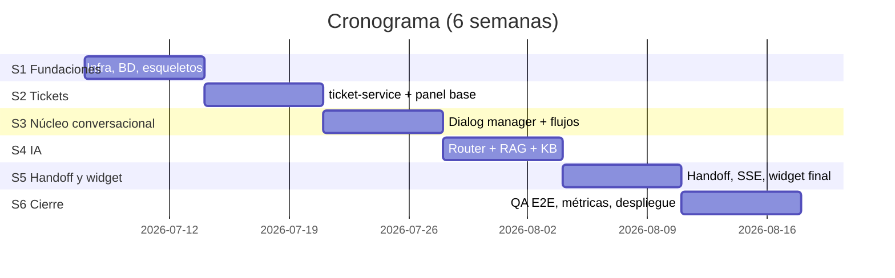

# PRD 08 — Plan de Implementación (6 semanas)

Plan diseñado para ser ejecutado por desarrolladores humanos **o agentes de IA**. Cada tarea indica: objetivo, especificación de referencia (no reinventar), entregable y criterio de aceptación verificable. El orden respeta dependencias; dentro de una semana las tareas marcadas ∥ pueden hacerse en paralelo.

---

## Semana 1 — Fundaciones

| # | Tarea | Especificación | Criterio de aceptación |
|---|---|---|---|
| 1.1 | Estructura del monorepo (`services/`, `widget/`, `db/`, `deploy/`) + linters (ruff, mypy) + pre-commit | `README.md` §estructura | `docker compose up` levanta esqueletos FastAPI con `/healthz` 200 |
| 1.2 ∥ | `docker-compose.yml` + Dockerfiles multi-stage + `.env.example` | `prd/07` §3–4 | Build reproducible desde cero; MySQL healthy; sin puertos internos publicados |
| 1.3 ∥ | Migraciones Alembic con el DDL completo de ambos esquemas + seeds (categorías, staff, secuencias) | `prd/03` §2–3, §5 | `alembic upgrade head` idempotente; seeds cargados; vistas creadas |
| 1.4 | Módulos comunes: envelope de respuesta, manejo de errores, logging JSON, config Pydantic Settings | `prd/04` §2 | Tests unitarios del envelope y validadores |

## Semana 2 — Dominio de tickets

| # | Tarea | Especificación | Criterio de aceptación |
|---|---|---|---|
| 2.1 | API-01 (registrar) con generación transaccional de código RN-01 + Idempotency-Key | `prd/04` §3, `prd/01` RN-01 | Test: 100 registros concurrentes → códigos únicos y correlativos; reintento con misma key no duplica |
| 2.2 | API-01b adjuntos (validación MIME real, ≤5 MB) + job de purga de huérfanos | `prd/01` RF-13 | Test: PDF válido pasa; `.exe` renombrado a `.png` es rechazado |
| 2.3 ∥ | API-02 (consulta por código y por correo) con RN-03 | `prd/04` §3 | Test: correo ajeno → 403; datos coinciden con BD (QA-02) |
| 2.4 ∥ | API-03 (escalar) + máquina de estados de ticket RN-02 + `ticket_historial` | `prd/02` §6 | Test: transiciones inválidas → 409; historial completo (QA-05) |
| 2.5 | Login staff (Argon2 + JWT) y panel base: listado/filtrado de tickets, cambio de estado, asignación | `prd/04` §3 panel | Técnico autenticado gestiona tickets; usuario sin rol no accede |
| 2.6 | API-06 encuestas | `prd/04` §3 | Calificación fuera de 1–5 → 400; duplicada → 409 (QA-10) |

## Semana 3 — Núcleo conversacional (sin IA todavía)

| # | Tarea | Especificación | Criterio de aceptación |
|---|---|---|---|
| 3.1 | Sesiones de chat + persistencia de mensajes con `latencia_ms` (RF-09) | `prd/04` §4 | Toda interacción queda en `mensajes` con timestamp (QA-07) |
| 3.2 | Dialog Manager: motor genérico de máquinas de estado (`flujo_activo`/`flujo_contexto`) | `prd/05` F-01 | Framework probado con un flujo dummy; estado sobrevive reinicio del servicio |
| 3.3 | Flujo F-02 registrar incidencia (validaciones QA-06, confirmar/corregir/cancelar, llamada a API-01) | `prd/05` F-02, `prd/01` §4 | E2E: happy path completo devuelve código de ticket real (QA-01); correo inválido re-solicitado |
| 3.4 ∥ | Flujo F-03 consultar estado | `prd/05` F-03 | E2E QA-02 |
| 3.5 ∥ | Flujo F-06 escalar + F-08 encuesta | `prd/05` F-06/F-08 | E2E QA-05 y QA-10 |
| 3.6 | Fallback F-09 (contador, mensajes de fallo 1 y 2, menú fijo) + respuestas sociales fijas + timeout RN-09 | `prd/05` F-09, `prd/01` §2 | Test: 3 "asdfgh" seguidos → handoff pendiente creado |
| 3.7 | Widget v1: burbuja, ventana, botones, formulario, envío de adjuntos (sin SSE aún) | `prd/02` §2 | Flujos completos usables desde un HTML de prueba, responsive móvil |

## Semana 4 — IA: router y RAG

| # | Tarea | Especificación | Criterio de aceptación |
|---|---|---|---|
| 4.1 | Router capa 1 (reglas/regex/keywords/etiquetas) | `prd/06` §2 | Set de pruebas de intención: capa 1 resuelve saludos, códigos INC-*, botones al 100 % |
| 4.2 | Router capa 2: clasificador con structured outputs + umbral 0.55 + fallback a `no_comprendida` | `prd/06` §2 | Precisión ≥ 90 % sobre el set de ≥10 frases/intent |
| 4.3 ∥ | Módulo embeddings + Chroma: indexación, chunking, upsert incremental, comando `reindex` | `prd/06` §4 | Reindex idempotente; edición de artículo se refleja sin reinicio (RF-12) |
| 4.4 | Generación RAG con prompt estricto + umbral de similitud + streaming interno | `prd/06` §3 | Set de 30 preguntas: respuestas fundadas; pregunta sin cobertura → limitación + oferta de ticket (QA-03) |
| 4.5 | Carga de la base de conocimiento inicial (≥15 artículos validados con CTIC) | `prd/03` §5 | Artículos en BD e indexados; revisión de contenido firmada por CTIC |
| 4.6 | Flujos de diagnóstico F-05 (WiFi, Aula Virtual, software, correo) con pre-llenado de F-02 | `prd/05` F-05 | E2E QA-04: respuestas cambian según lo respondido; rama "no resuelto" registra ticket con contexto |
| 4.7 | Modo degradado sin LLM (FULLTEXT + reglas) + `healthz` con estado `llm` | `prd/06` §6 | Con API key inválida, los flujos guiados siguen operativos y FAQ responde textual |

## Semana 5 — Handoff, streaming y pulido

| # | Tarea | Especificación | Criterio de aceptación |
|---|---|---|---|
| 5.1 | SSE en el widget: streaming de respuestas RAG + degradación a polling | `prd/04` §4 | Primer token < 3 s en respuestas largas (REN-01) |
| 5.2 | Handoff completo F-07: PAUSED/ACTIVE, cola en panel, chat agente↔usuario, cierre + encuesta, expiración 10 min | `prd/05` F-07 | E2E: fallback x3 → agente responde desde panel → cierre reactiva bot |
| 5.3 ∥ | CRUD de base de conocimiento en panel admin (RF-12) | `prd/04` §4 | Editar artículo → respuesta RAG refleja el cambio |
| 5.4 ∥ | Endpoint y vistas de métricas (RF-14) + contador de tokens LLM | `prd/04` §8, `prd/03` §4 | Números cuadran contra datos de prueba conocidos |
| 5.5 | Seguridad transversal: rate limiting Nginx, CORS, sanitización, revisión SEG-01..05 con checklist | `prd/02` §7 | Checklist firmado; escaneo básico (headers, XSS en chat) sin hallazgos altos |

## Semana 6 — Calidad, despliegue y evidencia de tesis

| # | Tarea | Especificación | Criterio de aceptación |
|---|---|---|---|
| 6.1 | Suite E2E automatizada que cubre QA-01…QA-11 (pytest + httpx; UI con Playwright para el widget) | `prd/01` §6 | **100 % de QA en verde en CI** — gate de release |
| 6.2 | Prueba de carga: 50 sesiones concurrentes, flujos mixtos (Locust) | `prd/02` §8 | p95 < 3 s en flujos; sin errores 5xx (QA-09, QA-11) |
| 6.3 | CI/CD: build, tests, publicación de imágenes taggeadas | `prd/07` §5 | Tag `v0.1.0` → imágenes en registry |
| 6.4 | Despliegue en servidor (universidad o VPS de contingencia para la tesis) con TLS, backups y monitoreo | `prd/07` §2–6 | Smoke test en producción; backup restaurado una vez como prueba |
| 6.5 | Documentación operativa: manual de despliegue, manual del panel (agentes/admin), guía de integración para el equipo PHP | `prd/07` §7 | Revisada por una persona ajena al desarrollo |
| 6.6 | Paquete de evidencia para la tesis: export de métricas pre/post, resultados de precisión del router y fidelidad RAG | `prd/06` §7, `prd/03` §4 | Datos exportables en CSV reproducibles con un comando |

---

## Definición de terminado (DoD) global

1. Los 11 criterios QA del DRS pasan en la suite E2E automatizada (CI).
2. Cobertura de tests unitarios ≥ 70 % en módulos de dominio (dialog manager, router, tickets).
3. `docker compose up -d` desde un servidor limpio deja el sistema operativo con un solo archivo `.env`.
4. Sin secretos en el repositorio (verificado con gitleaks en CI).
5. Documentación de este PRD actualizada si la implementación se desvió (los PRD son la fuente de verdad viva).

## Riesgos y mitigaciones

| Riesgo | Prob. | Impacto | Mitigación |
|---|---|---|---|
| Sin acceso a servidor universitario a tiempo | Media | Alto | VPS temporal para el post-test (misma imagen Docker); el despliegue institucional queda documentado |
| Costo/lentitud del LLM | Baja | Medio | Capa de reglas + umbrales + modelos configurables (Haiku como plan B); modo degradado §6.6 |
| Base de conocimiento pobre → RAG débil | Media | Alto | Tarea 4.5 con validación del CTIC como gate; métrica de "sin respuesta" vigilada semanalmente |
| Baja adopción de usuarios en el post-test | Media | Alto | Coordinar difusión con CTIC/FIIS desde la semana 4; widget visible en el sitio de la facultad |
| Cambios del contrato al integrar el sistema real | Media | Medio | Contratos API-01..03 congelados (`prd/04`); cliente HTTP encapsulado en un solo módulo adaptador |
